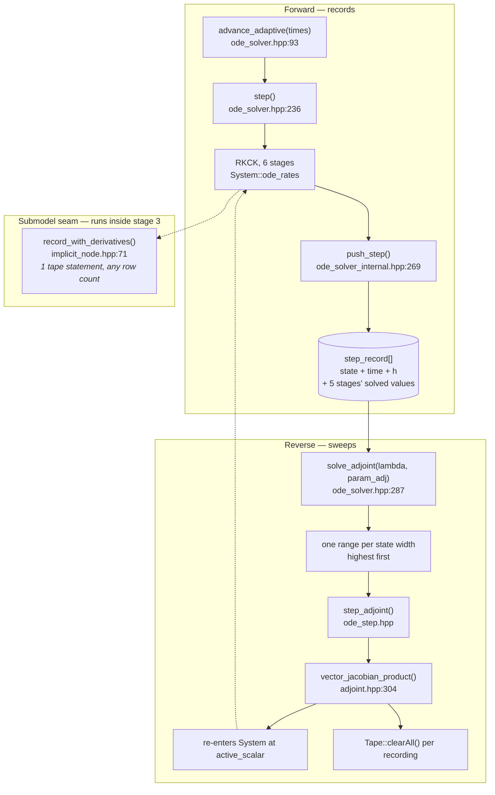

# odelia

**Base** `traitecoevo/odelia:master` · **Head** `aornugent/odelia:ad/V4-reverse-tf24`
**Tag on merge** `v0.5.0` · **Blocks** phylloptim, then plant

## Title

Differentiate a recorded run in reverse mode

## Body

Calibrating a model against data needs the derivative of a solved
trajectory with respect to every parameter. Forward mode costs one solve
per parameter. Reverse mode costs one solve for all of them, but it must
record every operation the solve performed first, and a run of several
thousand adaptive steps performs far more than memory holds.

`Solver::solve_adjoint()` computes that derivative. The forward pass
stores one `step_record` per accepted step; the reverse pass re-records
one step's arithmetic at a time, so the tape never grows past a single
step. `implicit_node.hpp` attaches a derivative obtained by other means,
for a value a submodel solved for rather than computed. `spline.hpp`
becomes `hermite_interpolator`, which takes a slope alongside each knot
value; values move for a caller that has only knot values. `ode_fit.hpp`
and its `Solver_fit()` / `Solver_set_target()` bindings are removed, and
`Solver_*` no longer takes `active`.

Closes #

## First comment

### What lands

Five new headers, 1,117 lines:

| header | lines | holds |
|---|---|---|
| `adjoint.hpp` | 507 | `adjoint_rows`, `active_system<System>`, `tape_scope`, `vector_jacobian_product`, `state_and_parameter_adjoints` |
| `implicit_node.hpp` | 397 | `record_with_derivatives`, `implicit_value`, `preaccumulate`, `record_report`, `input_and_derivative` |
| `sweep.hpp` | 94 | `state_at_range`, `program_from` — replay helpers; the consumer is plant's `scm.h` |
| `tangent.hpp` | 75 | `tangent_scalar`, `CarriesDirection`, `seed_direction`, `derivative_along`, and the nesting `static_assert` |
| `with_slope.hpp` | 44 | `with_slope<T>` — a value and its slope as one type |

Two deleted: `spline.hpp` (466), `ode_fit.hpp` (100).

Four rewritten: `interpolator.hpp` (+640, absorbs the spline as
`hermite_interpolator`), `ode_interface.hpp` (+496, the System contract becomes
concepts), `ode_solver.hpp` (+392, `solve_adjoint` and the recording),
`solver_interface.hpp` (−293 net, the passive/active Solver pair collapses to
one).

### Control flow

The load-bearing edge is the dashed one back into `ode_rates`. The reverse pass
**re-runs the forward model** at an active scalar rather than reading anything
cached, so every seam in the forward path is a seam in the sweep. A quantity
that is cached, or that depends on the order rates are computed in, differs
between the two passes unless something makes it agree.

### Reading order

1. `tangent.hpp` and `with_slope.hpp` — 119 lines, the vocabulary everything else uses.
2. `ode_interface.hpp:196-222` — `instruction` and `step_record`. This is what a forward pass stores and the only thing the reverse pass may read.
3. `ode_solver_internal.hpp:269` — `push_step`, the one place a record is written.
4. `adjoint.hpp:304` — `vector_jacobian_product`, the record-once sweep-many primitive.
5. `ode_solver.hpp:287` — `solve_adjoint`, which drives ranges over it.
6. `implicit_node.hpp` last. It is independent of the solver and is the piece phylloptim consumes.

### What to check the code against

Each of these is a claim the diff makes. They are the useful things to disbelieve.

| claim | where to test it |
|---|---|
| Peak tape is one step, whatever the run length | `clearAll()` per recording, `adjoint.hpp:324`, `:417`; the tape is constructed once for the descent, `ode_solver.hpp:335` |
| A segmented sweep equals a whole one, bit for bit | `solve_adjoint`'s two overloads, `:287` and `:397` |
| `lambda` is replaced per sweep; `parameter_adjoint` accumulates | `adjoint.hpp:447` — the `+=` is deliberate and the caller must zero |
| The System's state width is restored on every exit including a throw | `restore_on_exit`, `ode_solver.hpp:318-330` |
| `record_with_derivatives` is one tape statement whatever the row count | asserted in `tests/standalone/r_free.cpp:507` |
| All rows are checked before any is recorded | `implicit_node.hpp:79`; on failure `into = value` and the report says which input |
| A tangent above an adjoint is refused at compile time | `tangent.hpp:36`. Three kernels cost 31 statements flat and 566 nested |

### Two things a reviewer will want flagged

**The System contract changed shape.** `needs_time`, `has_cache` and
`has_state_check` become the concepts `HasOdeTime`, `SolvesForValues`,
`ChecksState`, `Rebindable` (`ode_interface.hpp:101-263`). `rebind()` becomes
`rebind_from()` — the type parameter is named rather than defaulted, because
"defaulting it to the System's own scalar asks whether a System can rebind to
the scalar it already has, which is a different question" (`:109`). A System
entering a sweep must add `rebind_from`, `ad_parameters`, `for_each_active` and
`set_recorded_state`.

**`visit_active` skips a shape it cannot open, in silence**
(`ode_interface.hpp:66`). Everything that carries a derivative row must declare
`for_each_active` or contribute nothing, with every number still finite. That is
why `with_slope` is a type rather than two arguments.

### Why the derivative is supplied rather than recorded

Solving a submodel in plain arithmetic and handing the outer tape a derivative
block obtained elsewhere is the first-class use case of every AD framework we
surveyed: JAX's `custom_root` and `custom_vjp`, PyTorch's `autograd.Function`,
ADOL-C's `ext_diff_fct`, CoDiPack's `ExternalFunctionHelper`, dco/c++'s external
adjoints, Tapenade's `_D`/`_B`. Naumann names two variants — preaccumulation,
which sweeps an inner tape `min(n, m)` times, and the Symbolic Adjoint pattern,
which uses the implicit function theorem and sweeps nothing. This is the second.

The choice is a ratio. Counted in statements walked, with `T` submodel
statements, `k` seeds and `m` outputs:

| | walks per solve | at T=360, k=3, m=6 |
|---|---|---|
| recorded inline | `T + kT` | 1440 |
| preaccumulated | `T + mT + m + km` | 2544 |
| supplied | `m + km` | 24 |

Preaccumulation loses whenever the submodel has more outputs than the consumer
has seeds. This leaf has double.

### Interpolation

`hermite_interpolator` is local cubic Hermite, C1, linear past the end knots.
The old spline was global natural cubic, C2, quadratic past the end. Knots are
hit exactly; everything between and beyond differs. A caller supplying only
values gets Fritsch–Carlson limited slopes.

Local rather than global because the global fit converged at `h²` against `h³·⁷`
for the same knots read as a Hermite, and because a global solve makes every
knot influence every span — an O(1) adjoint becomes O(K). Nothing read a second
derivative.

Nothing in phylloptim or plant included `spline.hpp` or `ode_fit.hpp`, so the
in-family migration cost is zero.
