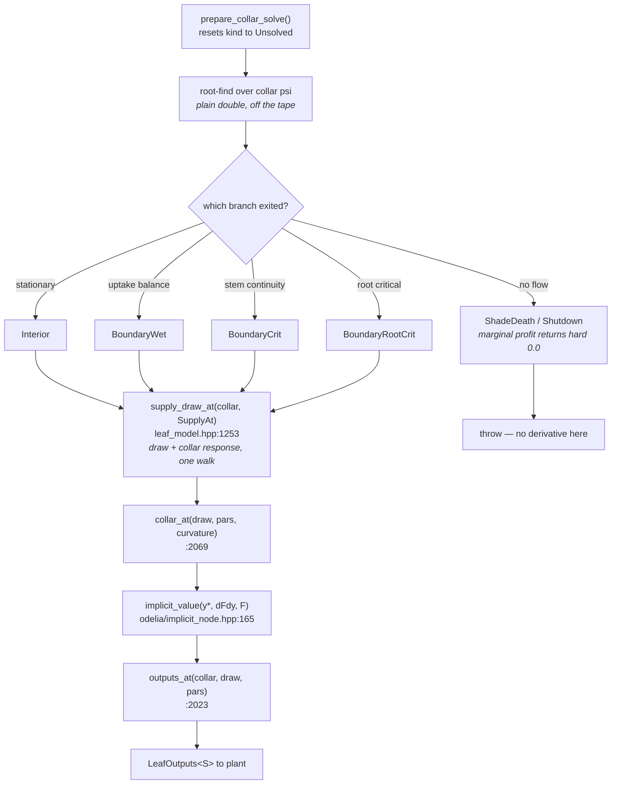

# phylloptim

**Base** `traitecoevo/phylloptim:master` · **Head** `aornugent/phylloptim:ad/V4-reverse-tf24`
**Tag on merge** `v0.9.0` · **Needs** odelia `v0.5.0` tagged first

## Title

Supply exact derivative rows for the leaf solve

## Body

The leaf picks its operating point by root-finding for the root-collar
water potential that maximises gain net of hydraulic risk. A consumer
differentiating this model had to record that search, which
differentiates the solver rather than the model: the answer depends on
the starting guess and the convergence tolerance.

`Leaf` is now templated on its scalar and supplies the derivative of the
operating point directly, from the implicit function theorem at the
converged point. The path is `supply_draw_at()` for the soil draw and
its collar response in one walk, `collar_at()` for the potential, then
`outputs_at()` for profit and uptake. `operating_point_kind()` reports
which of four residuals pinned the point; where no derivative exists the
call throws rather than returning a plausible number.
`vulnerability_curve_ncontrol` defaults to 400 rather than 100, so every
caller's numbers move.

Closes #

## First comment

### What lands

Two new headers; no deletions; two files carry the change.

| file | lines | what it is |
|---|---|---|
| `leaf_model.hpp` | +1622 | the leaf, now `Leaf` templated on its scalar |
| `roots.hpp` | +443 | multi-layer uptake, and the collar response in the same walk |
| `vulnerability.hpp` | +76 | `weibull_b_from_P50`, `TraitRows`, `vulnerability_derivatives_at` |
| `closed_form_rows.hpp` | 73 | new — closed-form derivative rows onto a table read |
| `clamp_sites.hpp` | 68 | new — `clamp_site`, `clamp_counter` |
| `gradient.hpp` | +113 | the `par_*` enumeration moves here from `gradient::` |

### The types

| type | header | what it is |
|---|---|---|
| `Leaf<S>` | `leaf_model.hpp:121` | the model. `S` is `double`, `tangent_scalar<double>`, or `active_scalar<double>` |
| `leaf_pars<S>` | `:118` | `std::array<S, 20>` — the parameter pack, indexed by the `par_*` enumerators |
| `SupplyDraw<S>` | `:1225` | `{double at; with_slope<S> flux; vector<S> uptake; vector<double> duptake_dp}` — the soil draw at a collar, with its response |
| `PhotoCapacity<S>` | `:1837` | `{vcmax, transport, curvature, respiration}`. Declares `for_each_active` — see the hazard below |
| `LeafOutputs<S>` | `:1199` | `{S profit; vector<S> uptake}` |
| `OperatingPointKind` | `:2537` | which residual pinned the point. Written by the branch the solve exited |
| `CollarConductance<T>` | `roots.hpp:373` | `{T total; vector<double> per_layer}` — total active, layers passive, deliberately |
| `SupplyAt<T>` | `roots.hpp:357` | a view over the caller's soil vectors; the curve arrives as `(P50, c)` |

### Control flow



At `S == double` the `implicit_value` node is skipped entirely
(`leaf_model.hpp:6036`) and the same source is an ordinary forward solve.

### Reading order

1. `clamp_sites.hpp` and `vulnerability.hpp` — 144 lines, the small vocabulary.
2. `roots.hpp:357-383` — `SupplyAt` and `CollarConductance`, then `uptake_impl` at `:811`.
3. `leaf_model.hpp:1199-1253` — the output types, then `supply_draw_at`.
4. `leaf_model.hpp:2023-2082` — `outputs_at`, `collar_at`, `bound_at`. This is the derivative surface.
5. `leaf_model.hpp:5573` — `kernel_slope_at`, which is how a kernel's slope is taken without nesting scalars.
6. `closed_form_rows.hpp` — 73 lines, read last, it explains the table/closed-form split.

### What to check the code against

| claim | where to test it |
|---|---|
| An operating point is classified by the exit taken, never by the numbers returned | `dprofit_at_collar_psi` returns a literal `0.0` at `:4021` *before* setting `feasible`. A `\|dprofit\| ≈ 0 ⇒ interior` test reads a shutdown as stationary, and the curvature off the same sentinel agrees |
| Every path out of the solve writes its own rates | `test_operating_point_kind_is_written_by_every_path`, `test_leaf.cpp:816`. The one gap is documented at `:2431` — `optimise()` on the stem route leaves `Unsolved`, so `collar_at` throws rather than misreporting |
| The draw and the collar it was taken at are the same point | `check_draw`, `:1331`, an exact `!=` |
| The derivative's only error is the residual's distance from zero | measured at 1.6e-15 of the answer |
| A supplied row cannot be checked by differencing the step that consumes it | the block's forward value does not depend on a recorded input, so differencing returns identically zero on exactly those columns whether the row is right, wrong or absent |
| One statement per attachment, not one per row | `implicit_node.hpp:57` |

### The hazard worth reviewing hardest

`odelia`'s `visit_active` dispatches on `for_each_active`, then container, then
pointer, and **falls off the end doing nothing** for an aggregate matching none.
`PhotoCapacity` is an input to the `ci` residual's `implicit_value` (`:5760`).
Without its `for_each_active` member (`:1837`), the `vcmax`, `jmax`, curvature
and `R_d` rows never arrive — four trait columns read exact zero, every number
finite, nothing raised.

The same shape applies to `SupplyDraw` and `leaf_pars`. Adding a member to any
of the three and not visiting it is a silent wrong answer, so the comment at
`:1837` names the risk at the declaration.

### Why the implicit function theorem rather than a recording

With the operating point `p*` defined by `F(p*, θ) = 0`:

```
dp*/dθ  =  −(∂F/∂p)⁻¹ ∂F/∂θ
```

Both partials are of the residual, which is closed form, so neither needs
anything the solver did. Recording the root-find instead gives the sensitivity
of wherever that particular sequence of iterations stopped — it converges as the
tolerance tightens but is not the right answer at any finite tolerance, and its
error is a property of the solver's settings.

Cost points the same way: the solve is ~360 tape statements, contributed once
per recording and once per seed swept, so 1440 statement-walks per solved leaf
at three seeds. Supplying costs 24.

### One formula, four residuals

The kind selects which residual, not which formula. Fiacco's statement needs no
branch:

```
dΠ*/du  =  ∂Π̂/∂u|_p  −  Σⱼ μⱼ ∂cⱼ/∂u|_p
```

At an interior optimum every multiplier is zero and this is the envelope
theorem. At a bound the multiplier is exactly what the envelope theorem omits.

### Two smaller notes

**The vulnerability curves take their value from a pre-integrated table and
their derivatives from the closed form.** The value is the table's because the
solve ran on the table; the table's own slope is a property of the fit rather
than of the curve. One implementation for both curves, because written twice one
copy picks up the chain rule through the shape parameter and the other keeps a
partial at fixed scale — finite, plausible, wrong, and unreported.

**`roots` and `single_potential` both answer against a collar.** `roots` is the
network, layers strictly parallel and coupled only through the shared collar, so
`dE/dT_collar` is a plain sum of per-layer quotient terms. `single_potential`
answers the same four methods against one soil potential, because the models
this one is compared against are formulated that way and comparing under a
multi-layer network compares two things at once.
