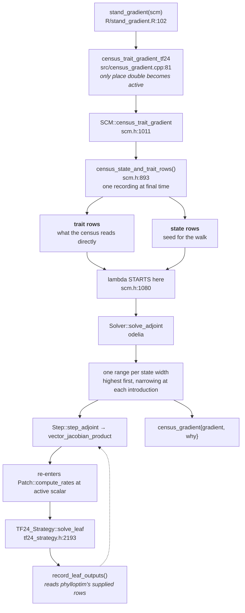

# plant

**Base** `traitecoevo/plant:develop` · **Head** `aornugent/plant:ad/V4-reverse-tf24`
**Needs** odelia `v0.5.0` and phylloptim `v0.9.0` tagged first

## Title

Differentiate a stand's census by trait

## Body

A leaf slightly cheaper to build shades its neighbours slightly more, so
they grow slightly less, so they shade it back slightly less. Fitting a
trait means asking what a century of that does to a stand summary, for
all forty-six TF24 traits at once. Differencing costs forty-six re-runs
and does not converge where a trait moves an event in the run.

`stand_gradient(scm)` returns that derivative exactly, from one run, as
`list(value, gradient, refusal, control)`. The model is templated on its
scalar: `Internals` becomes `Internals<double>` and `Individual::state`
returns `const value_type&`. `run_scm()` takes `record_trajectory` where
it took `use_ode_times`; `NodeSchedule` holds one row per instant, so
`$size` counts instants not introductions; `Interpolator` is gone and
`ResourceSpline` carries height, value and slope. TF24 numbers move:
`GSS_tol_abs` 1e-3 to 1e-1, `vulnerability_curve_ncontrol` 100 to 400.

Closes #

## First comment

### What lands

| file | lines | what it is |
|---|---|---|
| `models/tf24_strategy.h` | +2400 | the strategy, templated; absorbs the deleted `tf24_strategy.cpp` |
| `patch.h` | +1120 | the stand; `at_scalar`, `plant::tangent` |
| `scm.h` | +1002 | the solver and `census_trait_gradient` |
| `species.h` | +697 | per-species accumulation |
| `models/tf24_environment.h` | +524 | light and soil, templated |
| `census.h` | 59 | new — `census_metric<Strategy>`, `Censusable` |
| `census_gradient.h` | 57 | new — `census_gradient`, `refusal` |
| `clamp_sites.h` | 100 | new — clamp tally |
| `with_slope.h` | 38 | new — alias of odelia's |

Deleted: `adaptive_interpolator.{h,cpp}`, `optimize.h`, `tf24_strategy.cpp`,
`tf24f_strategy.cpp`.

Five new R exports: `stand_gradient`, `stand_census`,
`stand_census_state_adjoint`, `stand_gradient_compare`, `gradient_control`.

### The call a user makes

```r
p   <- scm_base_parameters("TF24")
p   <- add_strategies(p, trait_matrix(c(0.0825, 5.13), c("lma", "hmat")),
                      hyperpar = TF24_hyperpar, birth_rate = list(1.10))
scm <- run_scm(p, Environment("TF24"),
               Control(node_density_in_birth_date = TRUE),
               refine_schedule = TRUE, record_trajectory = TRUE)
g   <- stand_gradient(scm)
g$gradient["mass_above_ground", "1.lma"]
```

`gradient` is metrics by traits, columns `"1.lma"` — species-major, in
`ad_parameters()` order. `refusal` is one slot per metric, `NULL` where the
metric answered. `control` is the five settings the gradient was taken at, so
two gradients compare only when taken alike.

`Control(node_density_in_birth_date = TRUE)` is required and defaults to
`FALSE`; `require_birth_date_coordinate` (`scm.h:170`) refuses otherwise.

### Control flow



Two things to hold while reading. The direct term **seeds** the walk rather than
being added after it — *"a term added last is a term that can be left out, and a
gradient missing it is a plausible number rather than an error"* (`scm.h:1080`).
And the sweep **re-enters the forward model**, so `compute_rates` runs twice per
step: once in `double` on the forward pass and once at the active scalar here.

### Reading order

1. `census.h` and `census_gradient.h` — 116 lines. What a metric is, what a refusal is.
2. `tf24_strategy.h:649-671` — the three metrics TF24 declares, and `:224-310` — the parameter table with its 18 `no_gradient` entries.
3. `scm.h:1011-1150` — `census_trait_gradient` end to end. This is the orchestrator and the shortest complete path through the change.
4. `scm.h:893` — `census_state_and_trait_rows`, where both terms come from.
5. `tf24_strategy.h:2193` — `solve_leaf` and `record_leaf_outputs`, the seam with phylloptim.
6. `patch.h`, `species.h`, `node.h` last — they are the templating, mechanical once the above makes sense.

### What to check the code against

| claim | where to test it |
|---|---|
| A metric returns a number the sweep computed, or NaN with a stated reason — never a partial sum | `scm.h:1128-1145`. Refusal is metric-level because the failing row is an intermediate of a recording spanning six stages and every cohort, so no seed can attribute it |
| The gradient is of the birth-date coordinate, and the height coordinate is refused rather than answered | `scm.h:160-175`. On height the abscissa is state, so quadrature weights carry a derivative nothing supplies. One metric's trait sensitivity changes sign between coordinates |
| A parameter with no row cannot be asked for | `undifferentiable`, `tf24_strategy.h:224`, checked by `static_assert(column_count + undifferentiable.size() == field_count)` at `:375` |
| An exact zero in an answered row is the sweep's answer, not a gap | `scm.h:1141` |
| The tape defines match odelia's exactly | `src/Makevars:16`. A mismatch is a storage-class conflict on a symbol whose mangled name does not change: it links cleanly and is undefined behaviour |
| The gradient is TF24's | `census_gradient.cpp` names `TF24_Strategy` throughout; FF16 and K93 declare no `census_metrics` |

### The two terms

A census metric integrates a per-plant quantity over the size distribution, and
a trait reaches it twice.

The **trajectory term** is what the sweep produces: `lma` changes growth,
mortality and the light and water each plant competes for, all the way along, so
it changes the size distribution standing at the end.

The **allometric term** is what survives with that distribution held identical —
a cohort of a given height reads a different leaf area, because leaf area is
itself a function of the trait (`tf24_strategy.h:650`). No sweep produces it.
The boundary recruit node belongs here too: it is the trapezium's lower grid
point and is not ODE state.

### Scale of the answer

Environmental feedback suppresses the leaf-mass-per-area response about
sevenfold and **reverses the sign** of the seed-mass response, against the same
model with feedback removed. A per-plant calculation does not get a worse answer
here; it gets the wrong direction. That is the case for computing this at all.

A gradient over all traits costs about 2.9× a forward run of the same stand,
measured on the century fixture with the arms interleaved in one sitting.

### How the sweep is refereed

Differencing cannot check it — differencing is what it replaces, and near a
coincidence it does not converge: a step of one part in a million refined three
times gave −9.63, +166, −10588 against a feature five hundredths of a micron
wide. Six instruments, each blind to something:

| reference | catches | blind to |
|---|---|---|
| forward tangent of the same recording | stage recursion, both reductions, accumulation across cohorts | reads the same supplied leaf rows the sweep does |
| full block Jacobian at one cohort, both directions | localises to output row × input column; the only exhaustive one | same supplied rows; one state, no trajectory |
| captured difference of whole runs | a wrong row, not only wrong assembly — shares no arithmetic | refuses on shaded and clamped regimes |
| RHS differenced against state | soil balance, drainage cascade, retention curve | records nothing, cannot reach the leaf rows |
| RHS differenced against prepared traits | most trait columns of the transpose | exactly zero on the 12 leaf-own traits and 8 birth-size parameters |
| model rebuilt from parameters | the leaf-own traits and the seed-height row | patch only, no trajectory |

Injected corruptions establish these would notice a defect. A suite reporting
how much margin each check had says nothing about whether it would fire.

### Out of scope, stated so nobody assumes otherwise

Soil and atmospheric parameters have no rows, so "what if the soil were sandier"
cannot be asked of this. Crown shape has none. A trait row holds the
hyperparameters fixed, so an `lma` row differs by about threefold from the trait
an ecologist means by leaf mass per area. And a sensitivity is not a
physiological effect — the number cannot warn you about that one.
