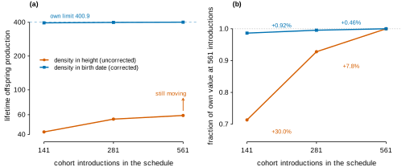
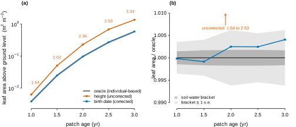
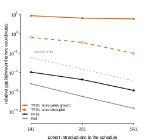
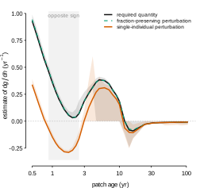
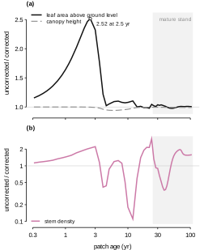
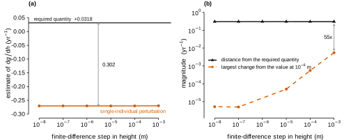

# A carried physiological state invalidates the standard compression term in cohort density transport

### Measured in the `plant` size-structured solver after a carbohydrate store was added to TF24

A solver that carries a population as a density over size must transport that density, and the
transport term needs the rate of change of growth with respect to size. The standard estimate
perturbs one individual's size and re-evaluates its rates. **That estimate stops computing the
required quantity — not approximately, but at all — as soon as growth depends on any state other
than size.**

The consequence here is an order of magnitude. Lifetime offspring production — the integral `plant`
uses to decide whether a strategy persists — is 42.14 at the production schedule and 400.92 in a
corrected coordinate. Refined to convergence the two do not approach each other: they reach 60.29 and
401.72, a factor of 6.66 apart, so the shipped value is 85% low and no amount of resolution recovers it.
An individual-based solver that carries no transport term agrees with the corrected coordinate to within
0.6% at every patch age and sits 1.6 to 2.5 times below the uncorrected one.

The error is absent on the two strategies whose growth is a function of size, so it does not cancel
when strategies are compared, and after canopy closure the two coordinates agree on the quantities
that feed back into the model. The correction alters no biological equation — carry the population as a
density per unit **birth date** rather than per unit height, a coordinate in which the transport term is
mortality alone. Disabled, the solver is bit-identical to the original.

---

## 1. The result

Four tests, each able to fail independently, none sharing an assumption with another.

| test | what is measured | result |
|---|---|---|
| **Schedule refinement.** The cohort schedule is refined through 141, 281, 561 and 1121 introductions and each coordinate extrapolated to its own limit. | lifetime offspring production | density in height 42.14 → 60.02, limit **60.29**; density in birth date 395.44 → 401.48, limit **401.72**. Both converge, to limits **6.66×** apart. |
| **Step size.** The finite-difference step of the perturbation is varied over five decades. | how far the shipped estimate sits from the quantity the transport term requires | **0.302** away, against its own drift of only 0.0055 across those five decades — a factor of 55. The corrected coordinate takes no derivative at all. |
| **Store decoupled inside TF24.** The store is integrated as before but nothing reads it, at three schedule resolutions. | relative gap between the two coordinates | **8.38, 6.28, 5.79** while growth and mortality read the store; **0.645, 0.357, 0.0966** once they do not, and falling with resolution. |
| **Independent solver.** A finite-population solver that follows individuals and has no transport term at all. | leaf area above ground level, patch ages 1 to 3 | density in height **1.6 to 2.5×** the individual-based value; density in birth date within **0.6%** of it at every age, inside that solver's own standard error. |

The first says both coordinates converge, and to different answers, so the shipped result is not merely
under-resolved. The second says the perturbation that produces it is itself fully resolved, so an
analytic or automatically differentiated derivative would return the same wrong number. The third
attributes the discrepancy to the carried state within a single strategy. The fourth compares both
against a solver that counts individuals and cannot prefer either.



**Figure 1.** Lifetime offspring production for TF24 under uniform midpoint refinement of the
introduction schedule, extended to 1121 introductions: (a) both coordinates against their
Richardson-extrapolated limits, which differ by a factor of 6.66; (b) the change over each halving,
normalised by each arm's own limit, against a second-order reference slope; (c) the relative gap between
the two extrapolated limits for each strategy. The uncorrected coordinate converges, at an observed tail
order of 2.15, to a limit 85.0% below the corrected one; on the two strategies whose growth is a function
of size the two limits coincide to 5.3 × 10⁻⁵ and 5.6 × 10⁻⁷.



**Figure 2.** Leaf area above ground level over patch ages 1 to 3 against the soil-corrected
individual-based solver at 128 m², ten paired mortality seeds, with soil water held at each end of the
range the SCM occupies: (a) absolute values, the oracle drawn as a band and the uncorrected coordinate
labelled with its factor at each age; (b) the same as a ratio to the centre of the bracket, magnified,
showing the soil bracket and the bracket widened by one standard error.

**On the two strategies whose growth is a function of size, the two coordinates converge to the same
limit**, which is the check that this is a change of coordinate and not a change of model. Extrapolated,
FF16's two limits agree to 5.3 × 10⁻⁵ relative and K93's to 5.6 × 10⁻⁷. The relative gap falls between
successive halvings of the cohort spacing at approximately the second order two second-order quadratures
of one integral should show — factors of 4.5 and 4.1 on K93, 2.4 and 3.6 on FF16. On TF24 it falls by
1.3 and then 1.1, stalls near 5.8, and the two limits differ by a factor of 6.66.



**Figure 3.** Relative gap between the two coordinates against schedule resolution, for the two
strategies whose growth is a function of size, for TF24 as shipped, and for TF24 with the store
integrated but read by nothing; the dashed guide has the slope of second-order convergence.
Decoupling the store inside TF24 returns it to the converging family.

## 2. What a density in height requires, and where it fails

A density in height has to satisfy two conditions. It has to exist, which requires that no two
cohorts occupy the same height. And its transport term has to be computable, which requires the rate
of change of growth with height. A carried state puts both at risk, and the first is the more severe.

### 2.1 Cohorts can reach the same height, and the density then does not exist

The map from birth date to height must be invertible for a density in height to be defined: if two
cohorts meet, the Jacobian `J` of Appendix A passes through zero and `n = ν/J` is undefined. Under
pure size structure that cannot happen, because two individuals at the same height in the same
environment grow at the same rate, so cohorts preserve their order. A carried state removes the
guarantee.

In the constant environment the rest of this report measures, it does not happen. Across 37 patch
states and 3 459 interior pairs there are zero crossings; the minimum gap is 1.6 × 10⁻⁵ m, with 14.2%
of gaps below 10⁻⁴ m; and the height growth rate was non-negative at every one of 6 390 sampled
cohort-times across the three strategies, and at a further 3 497 for TF24, with a TF24 minimum of
+2.6 × 10⁻¹² m yr⁻¹. 46% of interior pairs are closing at any instant, but extrapolating each
linearly at frozen rates the earliest crossing would be 4.05 years away, and none is realised.

Under an annual light cycle at full amplitude it does happen: **66 crossings among 10 011 interior
pairs, with a minimum gap of −0.00398 m** (§6.3). The smallest positive gaps in the other stress
cells fall to 4.4 × 10⁻⁸ m, two orders of magnitude below the constant-environment value. The
requirement is therefore not merely tight within the intended parameter envelope; it can be violated
inside it.

A violation does not stop the run. `Species::compute_competition` walks the node list from the front
assuming heights descend: it returns zero whenever the query height exceeds `nodes.front().height()`,
and it breaks out of the sum at the first cohort shorter than the query height. Out of order, both
shortcuts discard cohorts that do shade, so the light profile is underestimated and growth
overestimated, with no error raised. The correction removes the ordering requirement from the density
state but not from that loop; closing it is outstanding work (Appendix F).

§1 and §3 to §5 are constant-environment results and are unaffected, because the density exists
throughout them.

The birth-date coordinate does not remove the precondition so much as weaken it. A birth date is fixed
at birth, so the map is the identity and there is nothing to invert — but the quadrature still needs the
introduction times to be **distinct**, and zero width is as fatal to a trapezium as inverted order is to
a height-ordered walk. A scheduled run guarantees distinctness; a resumed one does not.
`Patch::set_initial_state` introduces its initial cohorts through the boundary node and stamps per-node
birth dates only when a caller supplies them, so a patch seeded without them gives every node the same
date, every interval zero width, and a competition profile of zero with no error raised. The difference
between the two coordinates is not that one has a precondition and the other does not; it is that the
height coordinate's is violated by the model's own dynamics, while the birth-date coordinate's is
violated only by a caller that omits the times.

### 2.2 The perturbation moves in a direction no individual travels

Take the 405 interior cohort pairs at patch ages 1.5 to 3, the interval in which the two coordinates
diverge. Neighbouring cohorts there are physiologically near-identical: median gap 2.44 mm, both
growth rates 2.398 m yr⁻¹ to four figures, and reserve fractions differing by a median of
1.1 × 10⁻⁵ against a fraction of 0.457 — at most 4.3% in relative terms anywhere in the interval, and
under 0.044% for three quarters of pairs.

The two estimates of the transport term nonetheless disagree in sign. The single-individual estimate
has median **−0.2312** and the required quantity median **+0.0674**, the estimate being 3.4 times
larger in magnitude. Since the neighbours are interchangeable, whatever is wrong cannot be that a
store lets them differ.

What is wrong is the direction in which the perturbation moves. TF24 gates growth on the reserve
**fraction** `r = S/S_max`, and capacity `S_max = a_st1 · mass_sapwood` increases with height. The
perturbation raises height while holding the absolute pool constant, which lowers `r` although no
carbon has moved. Along a trajectory the pool grows with capacity — which is what the measured
constancy of `r` between adjacent cohorts, two millimetres apart in height, states. **The
perturbation evaluates the growth rate at a combination of height and reserve fraction that no
individual in the stand occupies.**

The required quantity is the total derivative of growth with respect to height taken along a cohort's
own trajectory; the perturbation returns the partial derivative at fixed carbon. They differ by
`(∂g/∂S)(dS/dh)`, which for TF24 has the closed form `(1 − G) f / (w · S_max)` with `f = dS/dt`
(Appendix A). Substituting a perturbation that rescales the pool to hold `r` constant — one that moves
along the trajectory's own direction — recovers the required quantity to within 1–3%:

| patch age | pool held constant | fraction held constant | required |
|---|---|---|---|
| 0.5 – 1 | +0.198 | +0.7928 | +0.7877 |
| 1 – 2 | −0.221 | +0.2405 | +0.2390 |
| 2 – 3 | −0.209 | +0.0656 | +0.0634 |

That is a diagnostic, not a proposal: the two agree because `r` happens to be close to stationary
along trajectories at these parameters, which was measured rather than assumed and is not structural.



**Figure 4.** The three estimates of the transport term for TF24, as the median over interior cohort
pairs at each of 37 recorded patch states, with interquartile bands for the single-individual
perturbation and the required quantity; shading marks the states whose medians have opposite signs.

## 3. The correction

The transport term exists only to maintain a density in height, and the Jacobian it computes cancels
in both quantities the model forms from that density (Appendix A). Carrying the population as a
density per unit birth date removes the term instead of correcting it.

| | density in height | density in birth date |
|---|---|---|
| rate | `−dg/dh − mortality` | `−mortality` |
| at birth | `log(birth_rate · pr_estab / g)` | `log(birth_rate · pr_estab)` |
| light profile | trapezium over heights | trapezium over introduction times |
| soil draw | trapezium over heights | trapezium over introduction times |
| perturbation | one extra full rate evaluation per cohort per Runge-Kutta stage | not called |
| size distribution | an integrated ODE state | computed at report time |

No process moves an individual along the birth-date axis, so the transport term is mortality, which
is already an integrated state. The abscissa of both integrals becomes the introduction schedule,
which is known exactly rather than reconstructed from a derivative.

Implemented as `Control$node_density_in_birth_date`, default off, so both run from one build. With it
off, all three strategies reproduce the pre-change build bit-identically — `identical()` on the
offspring scalar, zero units in the last place — and the test suite passes: 2 363 assertions across
48 files, no failures, including the FF16 bit-identity reference comparison.

Three further consequences, each measured.

**The birth condition no longer divides by the growth rate.** `birth_rate · pr_estab / g` grows
without bound as a recruit's growth rate approaches zero, and the solver assigns zero density,
removing the recruit, when it is non-positive. At these parameters the recruit's growth rate never
reaches zero (minimum 0.0959, median 0.821 m yr⁻¹ over 140 introductions), so this is latent rather
than active. It still affects conditioning: the recruit's density spans a factor of 16.8 across the
run in height coordinates and 3.03 in birth-date coordinates, the latter being variation in
establishment probability alone.

**The state acquires an upper bound.** In birth-date coordinates `log density` is
`log(birth_rate · pr_estab)` minus an integral of mortality, so it cannot increase. Over all cohorts
and recorded times the maximum is +2.4168 in height coordinates and −0.0015 in birth-date
coordinates, the latter equal to the predicted bound. `Patch::check_finite_node_densities` aborts a
run when `log_density` exceeds 50; that guard cannot fire in birth-date coordinates.

**The size distribution becomes an output.** `n = ν/J` is evaluated when a run is reported rather
than integrated over a cohort's lifetime.

## 4. The error is confined to recruitment, which is why nothing caught it

The discrepancy is large for about three years and then stops reaching demography. Beyond patch age 25
the two coordinates agree on leaf area to a mean ratio of 1.005 (range 0.977 to 1.038) and on canopy
height to a mean ratio of 0.993 (0.992 to 0.995). Any check run on a closed-canopy stand therefore
passes.

Recruits are seeded at `a_st3 = 0.8` of capacity and are small, so their capacity rises steeply with
height. The omitted term is largest among fresh recruits, and its absence inflates their density.
Density reaches demography only through the two integrals of Appendix A, and during recruitment those
integrals are dominated by the cohorts whose density is wrong. Leaf area above ground level:

| patch age | uncorrected | corrected | ratio |
|---|---|---|---|
| 0.75 | 1.66 × 10⁻³ | 1.14 × 10⁻³ | 1.45 |
| 1.5 | 5.03 × 10⁻² | 2.49 × 10⁻² | 2.02 |
| 2.0 | 2.29 × 10⁻¹ | 9.74 × 10⁻² | 2.35 |
| 2.5 | 6.82 × 10⁻¹ | 2.71 × 10⁻¹ | 2.52 |
| 3.0 | 1.360 | 0.586 | 2.32 |
| 5.0 | 1.762 | 1.676 | 1.05 |



**Figure 5.** Ratio of the uncorrected to the corrected solver over the whole run: (a) leaf area above
ground level and canopy height; (b) stem density. Shading marks patch ages beyond 25 years. The two
quantities that reach demography return to 1 once the canopy closes; stem density does not.

The error does not go away when the canopy closes; it stops being visible in the quantities the model
feeds back on. The two coordinates never agree on stem density — mean ratio 1.35, range 0.37 to 1.96 —
because stem density counts the suppressed recruits whose density is misestimated, and those
individuals contribute almost nothing to either integral. That disagreement runs the length of the
simulation and is not adjudicated here: the individual-based solver's stem density varies too much
between replicates to say which coordinate is right (Appendix E). The size distribution is wrong for
the whole run; only its effect on demography is transient.

## 5. Consequences

**No biological equation changes.** Storage dynamics, the reserve gate, reserve-dependent mortality
and the birth reserve fill are untouched. What changes is the coordinate the population is counted in.

That distinguishes the correction from the other repair available. Making the store an explicit
function of size and environment would restore the size-structured premise by construction and remove
the problem. It would also remove the modelled process: a store whose contents are determined by
current size cannot record a past drought. Stefaniak et al. (2026), named in the storage pull request
as the agreed calibration target, report that the variance of stress duration shifts community
composition more strongly than its mean — an effect size of ω² = 0.25, classified "large", on the
Slow-Risky strategy's basal area against "very small" for the mean at almost every level of
stochasticity — and define their four strategies by a utilisation rate and a switch time, both
properties of the pool's dynamics.

**The affected interval coincides with the process the store was added for.** Stefaniak et al.
attribute the Slow strategies' success to a "high carbon storage minimum, which facilitated the
survival of small saplings in the shade". Suppressed saplings are the tightly-spaced, slow-growing
part of the size distribution, where cohort gaps fall below 10⁻⁴ m and a density in height is worst
conditioned, and §4 locates the error among recruits. Their own model did not encounter this: they
ran an individual-based solver, which has no transport term.

**The condition is not specific to storage.** Any state the growth rate reads produces it. The
allometric calibration factor Stefaniak et al. require, because gating growth breaks the pipe-model
balance and each component mass becomes independent, would add four more. A repair that adds
`(∂g/∂x_k)(dx_k/dh)` explicitly must be extended once per carried state and re-derived whenever the
physiology changes. Removing the change of variables does not.

**A reported result needs re-measuring.** The storage pull request reports single-species reproduction
dropping "~9× (227 → 25)" and raised `TF24_Strategy::scientific_version` to 3 on that basis. The
post-storage figure is computed with the invalid term: on TF24 the two coordinates differ by a factor
of 6.8 at the finest resolution tested and only one of them is converged. The pre-storage figure
should be insensitive to the coordinate, since without the store nothing but height enters the growth
rate, as on FF16 and K93 where the two agree to 1.2 × 10⁻³ and 1.4 × 10⁻⁴. The magnitude of the
reported drop is therefore not established. Its sign is not addressed here: the pre- and post-storage
runs use different parameter sets, and no run was made at the pull request's configuration.

## 6. Cost, convergence and robustness

### 6.1 The storage state's excursion below zero is a step overshoot the tolerance cannot remove

TF24's storage state is intended to stay in `[0, S_max]`. It does not: the minimum recorded value is
−2.249 × 10⁻³, in 14.0% of recorded cohort-times, affecting 65 of 142 cohorts, first at patch age
3.5. The outflow is gated by `floor_gate = S/(S + 10⁻³ S_max)` with `S` clamped at zero on read, so
the continuous solution decays exponentially toward zero and never crosses it; any negative value is
a single overshooting step, after which the clamp pins the rate at exactly zero and the state stays
negative until `net_flux = P − growth_flux` turns positive.

Tightening the integrator's absolute tolerance tests that reading:

| `ode_tol_abs` | min `S` | fraction of cohort-times with `S < 0` | min `S/S_max` | offspring | runtime |
|---|---|---|---|---|---|
| 1 × 10⁻⁴ (default) | −2.249 × 10⁻³ | 0.1396 | −0.1014 | 42.1402 | 105 s |
| 1 × 10⁻⁶ | −2.766 × 10⁻⁶ | 0.1324 | −0.01718 | 42.3479 | 423 s |
| 1 × 10⁻⁸ | run aborts: "Cannot achieve the desired accuracy" | | | | |

**The depth confirms the diagnosis and the frequency refutes the remedy.** A hundredfold tighter
tolerance makes the excursion 813 times shallower in absolute terms, which is what a discrete
overshoot does. The fraction of cohort-times spent below zero barely moves, 13.96% to 13.24%,
because that is set by how often the pool is empty, not by the step. No reachable tolerance removes
the excursion: 10⁻⁸ does not converge at all, so 10⁻⁶ is the practical limit here.

The relative worst case improves only 5.9-fold against 813-fold in absolute terms, so the deepest
proportional violations sit where `S_max` is smallest — the recruits. And offspring production moves
42.1402 to 42.3479, so the uncorrected baseline is itself sensitive to the integrator tolerance at
the 0.5% level. This defect is independent of everything else in this report; the fix is to make the
rate restoring below zero rather than pinned, which requires reading the unclamped state.

### 6.2 The corrected coordinate's leaf-area quadrature is second order; the uncorrected one is not

Before the individual-based solver's frozen soil water was identified (Appendix E), the candidate
explanation for the residual disagreement was that the corrected coordinate's own quadrature was
under-resolved. Excluding that is what sent the investigation to the other solver, and the exclusion
does not depend on the solver it exonerated: these are properties of one arm measured against itself,
with no ensemble anywhere in the derivation.

Refining through 85, 170 and 340 introductions, the corrected coordinate's leaf area approaches its own
Richardson limit by 0.34%, then 0.087%, then 0.022%. Successive-difference ratios are 3.980 to 3.994
across the five ages, an observed order of 1.993 to 1.998, so the trapezium over introduction times is
second order in the cohort spacing. The production schedule of 141, 281 and 561 introductions gives the
same orders and a total change of 0.29% to 0.33%.

**The uncorrected coordinate's leaf-area series is not cleanly second order.** Its observed orders at
the five ages are 1.96, 1.97, 1.97, 1.89 and 0.96 — falling to first order by age 3, which is where the
discrepancy between the coordinates is largest.

Offspring production converges first order in the corrected coordinate — §1's +0.92% then +0.46% —
because it is a further integral over patch age; the two quantities need not share an order. A
quadrature converged to 0.3% cannot generate a 13% discrepancy, which is what made the other solver the
remaining candidate.

### 6.3 The seasonal stress sweep

Twelve runs add an annual sinusoidal cycle — in rainfall at amplitudes 0, 0.3, 0.7 and 1.0 as a
fraction of the mean, and in incident light at 0.7 and 1.0, trough clamped at zero — in both
coordinate systems. All twelve completed; none failed. Three results.

**Cohorts cross in one cell of the twelve.** Under a full-amplitude light cycle the height coordinate
records 66 crossings among 10 011 interior pairs, with a minimum gap of −0.00398 m. The other eleven
record none, and no cell produces a crossing at the inflow boundary. The approach is visible in the
gaps: the smallest positive interior gaps under stress are 4.43 × 10⁻⁸, 4.84 × 10⁻⁸ and
5.55 × 10⁻⁸ m, against 8.21 × 10⁻⁶ m in the constant environment. §2.1 takes this up, because it is
a condition the height coordinate requires rather than a property of the sweep. Note that the
crossings occur where the stand has almost ceased to exist: at full light amplitude offspring
production is 1.04 × 10⁻⁴ against 1.37 × 10⁻⁴, four orders below the constant-environment values.

**The coordinate disagreement holds through mild seasonality and collapses only with the stand.**

| forcing | height | birth-date | ratio |
|---|---|---|---|
| none | 42.1402 | 395.441 | 9.38 |
| rainfall, amplitude 0.3 | 40.2662 | 374.881 | 9.31 |
| rainfall, 0.7 | 0.166081 | 1.10160 | 6.63 |
| rainfall, 1.0 | 0.0181662 | 0.152653 | 8.40 |
| light, 0.7 | 2.07650 | 14.1408 | 6.81 |
| light, 1.0 | 1.04361 × 10⁻⁴ | 1.37174 × 10⁻⁴ | 1.31 |

The ratio holds near 9.3 through mild seasonality, sits between 6.6 and 8.4 at higher amplitude, and
collapses to 1.31 only where both solvers report near-extinction. Convergence toward agreement at
the last row is not evidence that the coordinates agree; it accompanies a four-order collapse in the
quantity being compared.

**The storage excursion of §6.1 improves under stress rather than worsening.** The most negative
value is in the constant environment (−2.249 × 10⁻³ in height coordinates); it rises to
−8.48 × 10⁻⁴ at rainfall amplitude 0.3 and becomes positive at rainfall 0.7 and 1.0 and at light
0.7. It returns negative only at full light amplitude, at −6.82 × 10⁻⁵, still some thirty times
smaller than the constant-environment baseline.

### 6.4 Adaptive refinement keeps the cost advantage, once `schedule_eps` is chosen for the coordinate

`SCM::refine_schedule` flags cohorts whose integration error exceeds `schedule_eps` and bisects the
interval below them. It combines two error metrics. The reproduction one was already measured over
introduction times. The competition one was measured over the height grid, which is the wrong
abscissa once the competition integral is taken over introduction times, so it was measuring the
error of a quadrature it was not performing. It now uses `Species::quadrature_abscissae()`, whichever
abscissa the integral uses. `local_error_integration` takes absolute differences, so the height
branch's sign convention leaves it bit-identical, verified on FF16 and K93.

With that in place, adaptive refinement terminates normally in both coordinates for all three
strategies:

| arm | adaptive result | own Richardson limit | introductions | ODE steps |
|---|---|---|---|---|
| K93, height | 0.0305966 | 0.030570516 | 181 | 360 |
| K93, birth-date | 0.0306323 | 0.030570499 | 173 | 183 |
| FF16, height | 19.9888 | 20.03723 | 147 | 216 |
| FF16, birth-date | 20.0357 | 20.036170 | 157 | 225 |
| TF24, height | 60.35 | 60.294 | 204 | 6 233 |
| TF24, birth-date | 401.317 | 401.722 | 357 | 4 468 |

The adaptive results come from a solver reused across refinement iterations, which §6.6 shows is not the
same regime as a freshly built one: a fresh solver on TF24's 204-node schedule returns 60.1972 rather than
60.3519, 0.257% lower. Distances from the uncorrected arm's own limit are therefore good to about 10⁻³
and no finer. The factor of 6.66 between the limits does not depend on this.

**The corrected coordinate asks for more nodes and is still cheaper.** On TF24 it refines to 357
introductions against the height arm's 204 at the same `schedule_eps`. Cost is not the node count but
the number of rate evaluations, which is the sum over accepted steps of the live node count; on that
measure the corrected arm is 1.06 times cheaper at equal `schedule_eps` despite 75% more nodes, and its
cheapest setting is 1.13 times cheaper than the height arm's cheapest while being 861 times more
accurate. Measured wall clock confirms it: 146.72 s against 142.43 s at equal `schedule_eps` (§6.5).

**Equal `schedule_eps` is the only well-defined common setting, and matched accuracy is unattainable for
the height arm.** `local_error_integration` returns the area the trapezium loses if a node is deleted,
divided by the same integral, and that ratio is exactly invariant under any affine change of abscissa —
verified numerically to 1.9 × 10⁻¹⁵ across six decades of rescaling. Metres against years therefore
cannot matter and no scalar remapping of `schedule_eps` between coordinates exists. What differs is not
affine: `dh = g dt`, so the two metrics agree where the growth rate is constant across a stencil (median
ratio 1.11 where `g` varies by under 12%) and diverge in proportion to its variation (median 9 × 10¹⁰
where `g` varies by more than 1.6-fold). Since `g` spans some eleven orders of magnitude across nodes, a
like-for-like mapping would have to be node-local. The height arm's error against the correct answer is
84.9% to 85.9% at every `schedule_eps` tested and does not improve with refinement, so there is no
setting at which the two are equally accurate.

**Why the corrected coordinate asks for more.** Not because the schedule is more uneven in time — the
height grid is the more uneven of the two, with a coefficient of variation of 2.05 to 5.93 against 1.24,
and on a given state the height metric is the stricter. The difference is that bisection reduces the
birth-date arm's errors and does not reduce the height arm's. Tracing pass by pass on TF24, the height
arm's worst node error moves 0.560 → 1.230 → 0.378 as the interval below it is bisected, always at the
same introduction time near 0.0117 yr, because `n_h = n_t/g` is near-singular where growth stalls:
bisection makes the error worse before it makes it better, and the criterion is eventually satisfied by
a schedule that has resolved nothing.

**The corrected coordinate's accuracy saturates at about 200 nodes.** Its relative error reaches
7.8 × 10⁻⁴ at 180 introductions and then sits between 7.6 × 10⁻⁴ and 1.16 × 10⁻³ all the way to 507.
The default `schedule_eps` of 0.02 buys 357 nodes for no more accuracy than 0.2 buys with 203, at 1.86
times the cost, and 0.00632 is marginally worse again at 2.88 times. Below about 200 nodes the adaptive
placement is genuinely good — three to six times more node-efficient than uniform bisection — and above
it roughly 40% of the requested nodes are wasted. **TF24 in the corrected coordinate should be run at
`schedule_eps = 0.2`, not the inherited default.** Almost all the extra nodes land in the first year,
the establishment window, with a secondary cluster between 5 and 20 years and none after 20.

The two strategies whose growth is a function of size are the control. On FF16 at a relative error of
10⁻³ the corrected coordinate is 6.8 times cheaper, and the height arm cannot reach 3 × 10⁻⁴ at any
`schedule_eps` tested while the corrected arm reaches 2.1 × 10⁻⁴ at its loosest. On K93 the two are
comparable — the corrected arm 3.3 times cheaper at 10⁻², the height arm marginally cheaper at 10⁻³ —
which is the right answer for a model whose two limits agree to 5.6 × 10⁻⁷, and shows the comparison
does not manufacture an advantage where none exists.

### 6.5 The correction deletes an inner solve, and the saving grows with resolution

What the correction removes is not an arithmetic term but a complete rate evaluation.
`Node::growth_rate_gradient` copies the individual, perturbs its height and recomputes every rate, once
per cohort per Runge-Kutta stage; for TF24 each of those evaluations runs a leaf hydraulic optimisation.
Appendix A shows that the Jacobian this term exists to maintain cancels out of both integrals the model
forms from the density. The solver was running an inner numerical solve in its hot loop to produce a
number its own arithmetic then undid.

Measured on an idle machine, three repeats per arm, TF24 at two schedule resolutions:

| introductions | arm | median | repeats | accepted ODE steps |
|---|---|---|---|---|
| 141 | density in height | 105.0 s | 105.0, 103.8, 105.3 | 5 055 |
| 141 | density in birth date | 55.1 s | 55.0, 56.0, 55.1 | 4 013 |
| 281 | density in height | 259.6 s | 259.0, 262.2, 259.6 | 7 253 |
| 281 | density in birth date | 108.6 s | 108.2, 109.1, 108.6 | 4 646 |

**Speed-up 1.91x at 141 introductions and 2.39x at 281**, with a repeat-to-repeat spread near 1% at
both. The decomposition shows why the second figure is the larger one:

| | 141 | 281 |
|---|---|---|
| from taking fewer accepted steps | 1.26x | 1.56x |
| from each step being cheaper | 1.51x | 1.53x |

The per-step factor is the deleted evaluation itself, stable at 1.5 — not 2, because the perturbed
evaluation is not the whole cost of a step. The step-count factor is separate: the omitted term is built
from a `10⁻⁶` divisor that the adaptive controller has to resolve, and it costs relatively more as
cohorts pack closer together. The saving is therefore not a fixed factor. **It grows with resolution,
and resolution is what a converged answer costs.**

Under adaptive refinement the saving is realised provided `schedule_eps` is chosen for the coordinate
rather than inherited. At the inherited default the corrected arm requests 75% more nodes and still
comes out 1.03 times faster; because its accuracy saturates by about 200 nodes, a looser
`schedule_eps` reaches the same accuracy with 203 nodes and is **1.87 times faster** (§6.4).

Cost tracks the number of rate evaluations, which is the sum over accepted steps of the live node count
and not the step count alone — an RK stage evaluates every live node. Measured seconds per node-step are
constant to 3% across all three configurations, and give the per-step factor independently as 1.46 to
1.50.

Earlier work in this project reported a sixfold saving and, separately, a halving, both on a contended
machine. The halving is close to right at the production schedule and conservative at finer ones; the
sixfold is not supported.

### 6.6 State survives `SCM::reset()`, and the uncorrected coordinate is far more sensitive to it

Building a fresh solver for each run is reproducible: three repeats of TF24's 204-node schedule return
6 110 accepted steps and 60.1972008 every time. Reusing one solver and calling `reset()` between runs is
not. The first run on the object reproduces the fresh-object value exactly; every run after that returns
6 281 or 6 196 accepted steps and 60.3377 or 60.3392, values agreeing with each other to 1.5 × 10⁻⁵. This
is not scatter but two reproducible regimes, and the accepted step count moving between them points at the
integrator's step-size history surviving the reset.

**The asymmetry is the informative part.** Across the same schedules the uncorrected coordinate moves
2.33 × 10⁻³ between the two regimes and the corrected one 3.12 × 10⁻⁵, a factor of 75. The uncorrected
answer depends on the sequence of accepted steps because its transport term is a finite difference over a
`10⁻⁶` divisor; the corrected coordinate takes no derivative and barely registers the change. This is the
mechanism §6.5 identifies behind the step-count saving, showing up as sensitivity of the answer rather
than of the cost.

Two consequences for this report. The convergence series of §1 and the timings of §6.5 build a fresh
solver for every point, so the extrapolated limits carry no uncertainty from this; their uncertainty is
the assumed extrapolation order, which moves the uncorrected limit by 6.9 × 10⁻⁴ and the corrected one by
1.5 × 10⁻⁴. The adaptive sweep of §6.4 reuses one solver, so its values are post-reset ones and distances
from the uncorrected arm's own limit are quoted no finer than 10⁻³. The bit-identity check of §3 compares
first runs in fresh processes and is unaffected.

## Appendix A. The transport term derived

Let individual state be `x`, evolving as `dx/dt = v(x, E(t))`, with height `h = x₁` and growth rate
`g = v₁`. Cohorts are introduced at scheduled times; individuals within a cohort share a birth state
and thereafter an environment, so they remain identical to each other, and `x(t; a)` is a well-defined
map from birth date to current state. The living population is supported on the one-dimensional curve
that map traces.

No process moves an individual between cohorts, so writing `ν(a,t)` for the number of individuals per
unit birth date,

```
dν/dt = -mortality × ν          along a cohort
```

is the complete population balance. Define `J(t;a) = ∂h(t;a)/∂a`. The density in height is the
push-forward of `ν`, that is `n = ν/J`, and differentiating `J` along a cohort,

```
dJ/dt       = ∂/∂a [ g(x(t;a), E(t)) ]  =  Σ_k (∂g/∂x_k)(∂x_k/∂a)

d(log J)/dt = [ Σ_k (∂g/∂x_k)(∂x_k/∂a) ] / (∂h/∂a)  =  dg/dh along the cohort curve
```

so `d(log n)/dt = −mortality − dg/dh|curve`. If `g` depends only on height and the environment the
total derivative equals the partial `∂g/∂h` and the distinction does not arise. Otherwise the two
differ by `Σ_{k≠1} (∂g/∂x_k)(dx_k/dh)` with each `dx_k/dh` taken along the curve.

**The Jacobian cancels.** `log_density` enters the computation in exactly two places: the trapezium
that builds the light profile (`node.h:235`, summed in `species.h`) and the stand's draw on each soil
layer (`node.h:98`). It is read elsewhere only by a finiteness guard and by R-facing accessors,
neither of which feeds a rate. Both computational uses are integrals of the size distribution against
a per-individual quantity `e`, and since `n dh = ν da`,

```
∫ n(h) e(h) dh  =  ∫ ν(a) e(a) da
```

exactly. The density in height carries no information the birth-date density does not, and neither
integral requires `J`. The two discretisations are not identical — a trapezium in height and one in
birth date are different quadratures of the same integral — and §1 measures that difference
converging away where the growth rate is a function of size.

Computing `J` is therefore not a place where a modelling decision is made: given the growth rates,
the transport term is determined. An error in it changes the answer, but a different choice of it is
not an available hypothesis.

**For TF24 specifically**, write `g = C(h) · P₊(h) · G(r)` with `P₊` the smooth positive part of net
production and `G` the logistic gate on the reserve fraction. Then `∂g/∂S = g (1 − G)/(w · S_max)`
with `w = storage_gate_width = 0.1`, and since `dS/dh = f/g` along a trajectory, the omitted term is
`(1 − G) f /(w · S_max)`. The growth rate cancels — so it does not diverge where growth stalls, which
is the first thing one expects of it. Across the whole run this closed form tracks the measured
disagreement with a Spearman rank correlation of 0.933; in cohorts growing below 10⁻⁸ m yr⁻¹ it
predicts exactly zero and the measured value is 1.1 × 10⁻¹¹.

## Appendix B. The estimate is resolved; it is the wrong quantity

`Node::growth_rate_gradient` copies the individual, changes its height by `node_gradient_eps = 1e-6`
in a one-sided backward difference, re-runs the complete rate calculation — for TF24 including the
leaf hydraulic optimisation — and differences the growth rates. Evaluated on one patch state at age 2,
where neighbouring cohorts are near-identical (§2.2) so the neighbour difference `C` is a sound estimate
of the total derivative:

| step size | estimate | change from the `1e-6` value | distance from `C` |
|---|---|---|---|
| `1e-3` | −0.269644 | 5.5 × 10⁻³ | 0.3015 |
| `1e-4` | −0.270122 | 5.5 × 10⁻⁴ | 0.3019 |
| `1e-5` | −0.270173 | 5.0 × 10⁻⁵ | 0.3020 |
| `1e-6` | −0.270178 | — | 0.3020 |
| `1e-7` | −0.270179 | 5.0 × 10⁻⁶ | 0.3020 |
| `1e-8` | −0.270178 | 5.2 × 10⁻⁶ | 0.3020 |



**Figure 6.** `Node::growth_rate_gradient` evaluated at the patch state of age 2 across five decades of
finite-difference step: (a) the estimate against the required quantity; (b) the distance from the
required quantity against the estimate's own sensitivity to the step.

Converged to five decimal places across five decades. The distance from the total derivative is
0.302, which is 55 times its own variation across that range, and the total derivative's median
magnitude at that state is 0.0318. An analytic derivative, or one obtained by automatic
differentiation, would return this same value to machine precision.

In FF16 and K93 the growth rate is a function of height and the environment only. FF16 carries
heartwood as a state, but `FF16_Strategy::net_mass_production_dt` takes only the environment, height
and leaf area, and leaf area is a function of height, so heartwood does not feed back into growth. For
both strategies the partial and total derivatives coincide exactly.

## Appendix C. Measuring the disagreement without instrumentation

The number of individuals between two neighbouring cohorts can change only by mortality, and
mortality is an integrated state, so `log N + mortality` is constant along each cohort and
`N = density × gap` can be reconstructed from collected output. That drift is not independent
information: with `A` the single-individual estimate and `C` the neighbour difference,

```
d(log N)/dt = d(log n)/dt + d(log Δh)/dt = (−A − mortality) + C
```

so the drift over an interval is the time integral of `C − A`, plus the integrator's own error.
Interior intervals only; the lowest is bounded below by the fixed inflow boundary and genuinely gains
individuals.

| | summed drift | largest single cohort | pairs |
|---|---|---|---|
| TF24 | +245.8 | 158× | 9 555 |
| FF16 | +7.94 | 1.59× | 9 870 |
| K93 | +1.41 | 3.02× | 9 050 |

Totals cannot separate a discretisation error, which refines away, from an absent term, which does
not. Dividing by elapsed time and regressing the log drift rate on the log gap width does:

| | slope on log(gap) | R² |
|---|---|---|
| FF16 | +0.78 | 0.81 |
| K93 | +0.16 (magnitudes 10⁻⁹ to 10⁻³) | 0.01 |
| TF24 | −1.02 | 0.24 |

A quadrature error scales with the gap; FF16's does, and its magnitudes are three orders below
TF24's. TF24's slope is negative — its error is larger where cohorts are closer together. Regressing
on the growth rate instead gives slope +0.99 with R² = 0.94; fitting both, the growth-rate coefficient
is 1.04 and the gap-width coefficient falls to 0.16. The apparent gap dependence is a confound, since
small gaps occur where recruits grow fastest.

## Appendix D. Alternative explanations excluded

**Cohorts crossing in height.** This would invalidate the coordinate outright rather than merely make
its transport term hard to compute, so it is taken first rather than here: see §2.1 for the census in
the constant environment and §6.3 for the one cell of the stress sweep that crosses.

**Divergence of the omitted term at a growth stall.** `(∂g/∂S)(f/g)` appears to diverge as `g → 0`. It
does not: `∂g/∂S` carries a factor of `g` that cancels the `f/g` exactly (Appendix A). Measured, the
closed form is zero at stalls and the drift rate is 1.1 × 10⁻¹¹.

**The perturbation direction as a defect separate from the omitted term.** The three estimates in
§2.2 are estimates of one operator, not two errors in sequence. Correcting the direction removes 86.7% of
the total absolute disagreement (`Σ|A−C| = 623.7`, `Σ|A−B| = 541`, `Σ|B−C| = 121`) without removing the
condition that produced it, because a fixed-fraction perturbation is still a partial derivative.

**Differencing neighbours as the repair.** `(g_upper − g_lower)/Δh` converges to the total derivative
and costs nothing, since both growth rates are already computed. But it converges only where the two
cohorts are close in state, not merely in size. At patch age 24 a cohort at 41.4 cm with an empty
store grows at 0.025 m yr⁻¹ directly above a recruit at 34.4 cm growing at 0.142 m yr⁻¹ — 5.6 times
faster, seven centimetres away. There the neighbour difference gives −1.670 and the single-individual
estimate −0.132, and neither is a derivative of anything. Such pairs are 1.1% of 2 645 interior pairs
at a ratio above two and 0.3% above five, and they are the suppressed sapling bank. Refining the
schedule does not help, because more introduction times do not make a recruit and its shaded
neighbour more alike. The neighbour difference also divides by a gap whose measured minimum is
1.6 × 10⁻⁵ m.

## Appendix E. The individual-based comparison

`plant` carries a stochastic finite-population solver in which individuals arrive and die as discrete
events. It tracks individuals, not a density, and has no transport term, so in principle it cannot
favour either coordinate. Both solvers divide leaf area by patch area in `Patch::compute_competition`,
so the quantities are directly comparable.

**As shipped it is not a valid check on TF24.** `Patch::ode_size` adds `environment.ode_size()` to the
species' ODE size, and forwards `set_ode_state`, `ode_state` and `ode_rates` to the environment.
`StochasticPatch` does neither: its ODE system is the species alone. TF24's environment carries nine
ODE states — five soil moisture layers and four cumulative fluxes — so its soil water is never
integrated and holds its initial 0.214 for the whole run, while the same configuration under the SCM
recharges to 0.310613 by patch age 0.19 and is drawn down to 0.299220 by age 3. The stochastic stand
is permanently drier, grows more slowly, and reports less leaf area. `FF16_Environment` and
`K93_Environment` have `ode_size` zero, so the omission is exact for every strategy the solver had
previously been used on and wrong only for the one that carries a store.

The defect is also what makes the comparison possible. Because the environment is never integrated,
setting its initial soil water pins it for the whole run, so the runs below are made twice, at each end
of the range the SCM itself occupies. That removes the feedback by which a growing stand draws its own
soil down, so the two runs bound the answer under the SCM's soil trajectory rather than under the
oracle's own. What justifies treating them as a bound is the agreement reported below: the two stands
end up within 0.6% of each other and would therefore draw the soil down almost identically. Protocol: 128 m², regular arrivals at spacing 1/(birth rate × area) placed at interval
midpoints, establishment as a Bernoulli draw on the same probability, ten paired mortality seeds,
log-linear interpolation between snapshots. The SCM arms are truncated at patch age 3.5 and twice
midpoint-refined to 340 introductions; the truncation is exact, reproducing the published
141-introduction values to every digit. Plotted as Figure 2.

| patch age | oracle, soil 0.3106 | oracle, soil 0.2992 | s.e. | uncorrected | ratio | corrected | ratio |
|---|---|---|---|---|---|---|---|
| 1.0 | 0.003823 | 0.003812 | 0.000008 | 0.006269 | 1.64 | 0.003817 | 0.998 – 1.001 |
| 1.5 | 0.024858 | 0.024774 | 0.000058 | 0.050238 | 2.02 – 2.03 | 0.024795 | 0.997 – 1.001 |
| 2.0 | 0.096986 | 0.096644 | 0.000429 | 0.228720 | 2.36 – 2.37 | 0.097054 | 1.001 – 1.004 |
| 2.5 | 0.270120 | 0.269167 | 0.001000 | 0.680940 | 2.52 – 2.53 | 0.270304 | 1.001 – 1.004 |
| 3.0 | 0.582605 | 0.580676 | 0.002645 | 1.359107 | 2.33 – 2.34 | 0.584000 | 1.002 – 1.006 |

**The corrected coordinate agrees with the individual-based solver to within 0.6% at every age; the
uncorrected one is 1.6 to 2.5 times above it.** The agreement is inside the solver's own standard
error, 0.45% at age 3 over ten mortality seeds.

Four approximations remain, each measured rather than assumed. The soil-water bracket is 0.29% to
0.35% wide, so tracking the decline instead of holding it fixed cannot account for more than that. For
the first 0.19 years the SCM's soil is still recharging from 0.214, so the earliest cohort is treated
as slightly too wet at both ends of the bracket; weighted by that cohort's share of age-3 leaf area and
the measured sensitivity of growth to soil water, that is under 0.2%. Snapshots fall at introduction
events rather than on a fixed grid, and interpolating a convex trajectory between them biases early
ages upward — 16.3% at age 1 on a 4 m² patch, which is why 128 m² is used, where the same measurement
gives 0.015%. And replacing regular arrivals with Poisson arrivals at the same rate moves the result by
at most 0.9%, below the mortality-seed spread, so the conclusion does not rest on regularising the
arrival process.

The solver's own schedule builder was not used, because it passes patch area into the arrival
function's `delta_t` argument (Appendix F); the probes construct the schedule directly.

The individual-based solver cannot discriminate on the mature stand in any case: its living stem
density is too variable to separate the coordinates, its own largest-patch value moving 7.2, 5.1, 5.0,
6.3 and 2.0 individuals per m² across patch ages 20 to 100.

## Appendix F. Configuration, and defects found alongside

All results are measured on `plant` `develop` at commit `141dc8df`: single species, TF24 with
`lma = 0.1978791`, default `Environment` and `Control`, `max_patch_lifetime = 105.32`, 141 cohort
introductions, five soil layers, `refine_schedule = FALSE` unless stated, compiled `-O2 -DNDEBUG`.
Comparison runs use FF16 at `lma = 0.0825` and K93 at `b_0 = 0.059`. Refinement is by midpoint
insertion into the introduction schedule, so both coordinates see byte-identical schedules at each
level. Scripts and outputs are in [`probes/`](../../probes), whose
[index](../../probes/README.md) names the script behind each result and figure in this
report. The implementation is `plant` branch `claude/nsc-density-measurements-efiolz`.

**What this branch changes.** Three things, and nothing else. The `node_density_in_birth_date` flag and
the coordinate it selects (§3). `SpeciesBase::control()`, immediately below. And the schedule-refinement
error metric, which now runs over the abscissa the integral is actually taken over (§6.4). Every other
defect recorded here is left unfixed, including the stochastic solver's ODE omission that Appendix E
rests on: repairing it moves TF24's stochastic numerics and requires seed-pinned baselines to be
regenerated deliberately, which is a decision for the maintainers rather than a side effect of this
measurement.

**A latent compilation defect, fixed here.** `SpeciesBase::control()` called
`strategy->get_control()`, which no strategy defines. The member had never been instantiated, so the
error had never been compiled.

**The stochastic schedule builder ignores patch area.** `stochastic_schedule()` passes `patch_area`
into `stochastic_arrival_times()`'s third positional argument, which is `delta_t`, so arrival rates
never scale with area and the binning interval is set to the area. Passing it by name is the fix, but
`test-stochastic-patch-runner.R` runs at `patch_area = 50` with seed-dependent expectations, so
correcting it makes that file roughly fifty times heavier and requires its parameters and baselines to
be revisited. Recorded and left unfixed.

**The stochastic solver does not integrate the environment.** `StochasticPatch::ode_size` returns the
species' size alone, and its `set_ode_state`, `ode_state` and `ode_rates` do not forward to the
environment, where `Patch`'s do. Any environment carrying ODE state is therefore held at its initial
value for the whole run, which is the defect Appendix E measures. The fix mirrors `patch.h`: add
`environment.ode_size()` to the size and chain the three accessors through the environment. Closing the
water balance additionally needs the resource accumulation `Patch::compute_rates` performs, which
requires per-node and per-species `consumption_rate` forwarders the stochastic classes do not have. The
four ODE-interface lines carry the whole 13%; the consumption coupling is worth a further 0.35% at age
3 and grows with leaf area. FF16 and K93 have no environment ODE state, so their stochastic systems are
bit-identical either way; TF24's are not, so three length assertions and one seed-pinned survivor count
across `test-stochastic-patch-runner.R` and `test-stochastic-patch.R` move and would need regenerating
deliberately. Recorded and left unfixed.

**Newly introduced stochastic nodes never have their initial states set.**
`StochasticSpecies::introduce_new_node` computes rates without first calling `set_initial_states`, which
is what gives a TF24 recruit its birth reserve fill, so stochastic seedlings are born with an empty
store. Worth 0.45% of leaf area at patch age 1 and 0.13% at age 3. Recorded and left unfixed.

**A height-ordering dependence remains in the competition loop.** `Species::compute_competition`
breaks out of its sum at the first cohort shorter than the query height, and returns zero when the
query height exceeds `height_max()`, which reads `nodes.front().height()` rather than taking a
maximum. Both shortcuts are sound only while the node list is ordered by height — a property the
density state no longer requires, and one §2.1 records being violated 66 times under a full-amplitude
seasonal light cycle. Since the commit these results are measured at, `develop` has gained
`heights_are_decreasing()`, `scan_heights()` and a competition profile built over a sorted node grid, so
the machinery to close this now exists. What remains is to route the birth-date coordinate past it
rather than through it: a sort by height silently swaps the coordinate wherever cohorts cross, which is
the regime §6.3 measures.

**`refine_schedule` cannot tell a caller whether it converged.** It returns without reporting whether it
met `schedule_eps` or exhausted `schedule_nsteps`, and it installs the bisected schedule into
`parameters.node_schedule_times` while `offspring_production` still reflects the coarser schedule it last
ran. Every refinement in §6.4 converged on tolerance, so no result here depends on the distinction, but a
caller cannot currently draw it.

**The quadrature error of the youngest segment is never measured.** `Species::compute_competition`
includes a final trapezium segment running from the youngest resident cohort to the birth boundary, but
`r_compute_competition_effect_by_nodes_error` and `quadrature_abscissae` iterate the resident nodes only.
That segment carries a median 2.3% of the competition integral and up to 16.5%, so the refinement
criterion is blind to a term of that size. The omission is symmetric across both coordinates.

## References

Falster, D. S., FitzJohn, R. G., Brannstrom, A., Dieckmann, U., Westoby, M. (2016). plant: A package
for modelling forest trait ecology and evolution. *Methods in Ecology and Evolution* 7, 136-146.

Stefaniak, E. Z., Tissue, D. T., Falster, D. S., Medlyn, B. E. (2026). Greater variability in
environmental stress favours trees that prioritise storage of carbohydrate reserves over growth: a
modelling analysis. EGUsphere preprint, https://doi.org/10.5194/egusphere-2026-1474. Local copy:
[`docs/reference/stefaniak-et-al-2026-storage-strategies-egusphere-2026-1474.pdf`](../reference/stefaniak-et-al-2026-storage-strategies-egusphere-2026-1474.pdf)
(CC BY 4.0).
